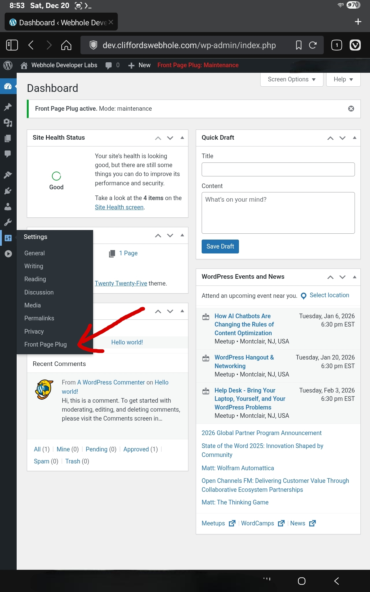
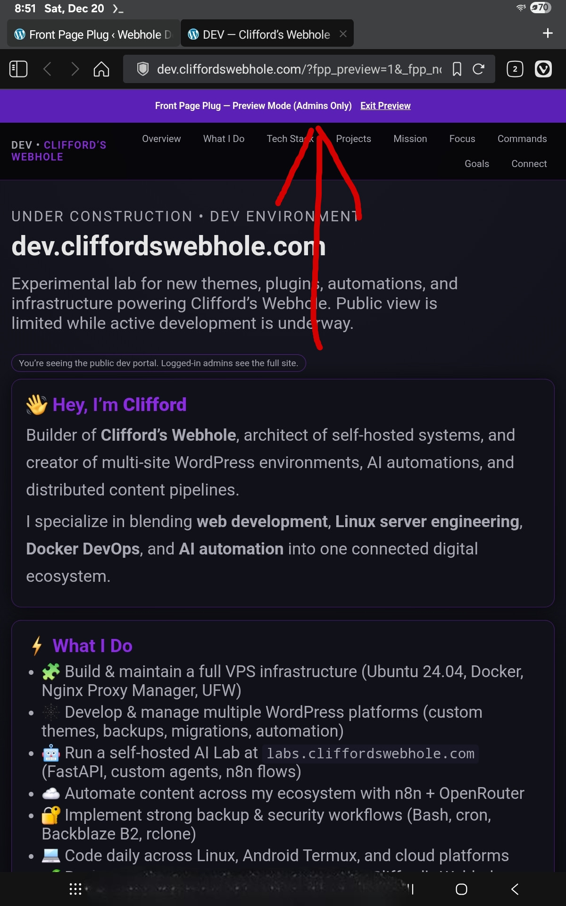
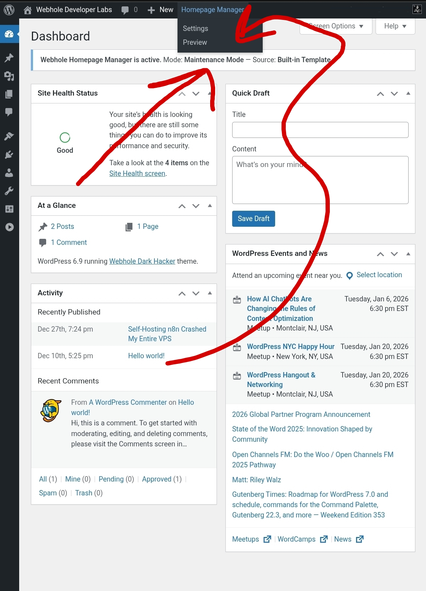
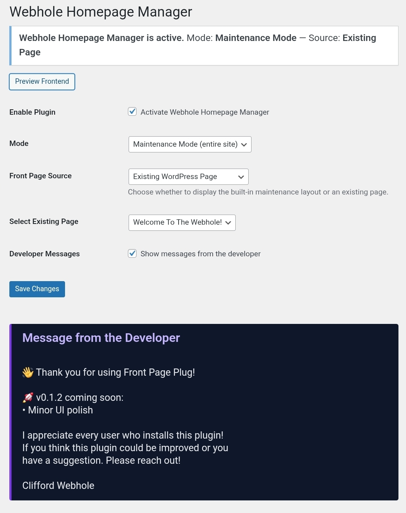

# Front Page Plug

Front Page Plug is a lightweight WordPress plugin that allows site owners and developers to:

- Display a custom front page without modifying the active theme
- Enable a clean maintenance mode
- Preview changes safely as an administrator
- Keep development work hidden while still informing visitors

Built for developers who value simplicity, control, and transparency.

---

## ✨ Features

- ✅ Maintenance Mode (restricts site access to a single front page)
- ✅ Custom Front Page Mode (replace homepage while keeping site accessible)
- ✅ Built-in front page template or existing WordPress page selection
- ✅ Admin-only preview mode (nonce-protected)
- ✅ Admin bar status badge
- ✅ Optional developer message / announcement box
- ✅ No theme modification required
- ✅ No tracking, no telemetry, no ads

---

## 🧭 Plugin Modes

### 🔒 Maintenance Mode
Displays a single front page to visitors and blocks access to the rest of the site.  
Administrators retain full access.

Ideal for:
- Active development
- Server maintenance
- Site rebuilds

---

### 🏠 Custom Front Page Mode
Replaces only the homepage while allowing visitors to browse posts and pages normally.

Ideal for:
- Landing pages
- Announcements
- Temporary homepages
- Custom layouts without touching the theme

---

## 🔍 Preview Mode (Admins Only)

Administrators can preview the front page exactly as visitors will see it without enabling it publicly.

Preview mode is:
- Admin-only
- Nonce-protected
- Clearly indicated in the admin interface

---

## ⚙️ Settings

All plugin settings are available under:

**Settings → Front Page Plug**

Available options:
- Enable / Disable the plugin
- Select operating mode
- Choose front page source (template or existing page)
- Preview front page
- Toggle developer messages

---

## 📸 Screenshots

### WordPress Settings

### Admin Preview Mode

### Admin Bar Status

### Settings Page

---

## 🧑‍💻 Philosophy

Front Page Plug is built with the following principles:

- Respect user privacy
- Avoid unnecessary complexity
- Keep logic transparent
- Fail safely and predictably
- Never lock users into a theme or framework

---

## 📦 Installation

1. Upload the plugin folder to `/wp-content/plugins/`
2. Activate **Front Page Plug**
3. Go to **Settings → Front Page Plug**
4. Choose your preferred mode and configuration

---

## 🧾 License

This plugin is licensed under the **GPL-2.0-or-later** license.

© Clifford Webhole  
https://cliffordswebhole.com
